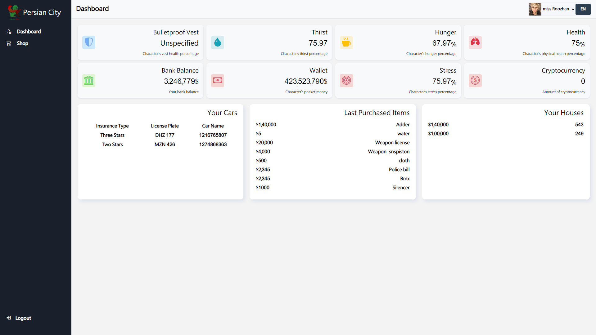

# Persian City Dashboard Project 🏙️  
**Fivem User Dashboard**  

A responsive, bilingual admin dashboard with a sleek shop interface, designed for practice and showcasing front-end development skills.  

  

## ✨ Features  

- **📱 Fully Responsive Design**: Optimized for all screen sizes.  
- **🌐 Bilingual Support**: Switch seamlessly between English and Persian.  
- **🎨 Modern UI**: Clean, intuitive interface with dynamic visuals.  
- **📊 Real-Time Stats**: Dashboard displays live updates on user data.  
- **🛒 Shop Interface**: Interactive product cards and purchase options.  
- **🔄 Language Switcher**: Instant toggle for multilingual support.  
- **📱 Mobile Navigation**: Smooth and user-friendly on any device.  

---  

## 🛠️ Technologies Used  

- **HTML5**  
- **CSS3**  
- **JavaScript**  
- **Bootstrap Icons**  
- **Box Icons**  

---  

## 📂 Project Sections  

### 📊 Dashboard  
- Monitor character stats: Health, Hunger, Thirst, etc.  
- View financial data: Bank balance, Wallet, Cryptocurrency.  
- Manage vehicles and properties.  
- Track recent purchases and activity history.  

### 🛒 Shop  
- Browse product cards with images and detailed information.  
- View prices, speed ratings, and specifications.  
- Purchase items easily with user-friendly buttons.  
- Access FAQs for quick assistance.  

---  

## 🚀 Getting Started  

1. Clone the repository:  
   ```bash  
   git clone https://github.com/Code1616/persian-city-dashboard.git  
   ```  

2. Open **index.html** in your browser to explore the dashboard.  
3. Open **shop.html** to experience the shop interface.  

---  

## 📁 Project Structure  

```  
persian-city-dashboard/  
│  
├── index.html          # Dashboard page  
├── shop.html           # Shop page  
├── style/  
│   ├── style.css       # Main dashboard styles  
│   └── style-shop.css  # Shop styles  
└── image/  
    ├── logo.png  
    └── car.png  
```  

---  

## 🌐 Browser Support  

- **Chrome** (latest version)  
- **Firefox** (latest version)  
- **Safari** (latest version)  
- **Edge** (latest version)  

---  

## 📸 Credits  

- The user profile image used in this project was sourced from [Pinterest](https://www.pinterest.com/pin/gta-5--749567931721568205/).  

---  

## 📝 Note  

This is a **practice project** aimed at learning front-end development techniques. It highlights responsive design, bilingual support, and modern UI/UX principles.  

---  

## 📜 License  

**MIT License** – Feel free to use or adapt this code for your own learning purposes.  

---  

**⚠️ Disclaimer**: This project is for educational purposes only and not intended for production use.  